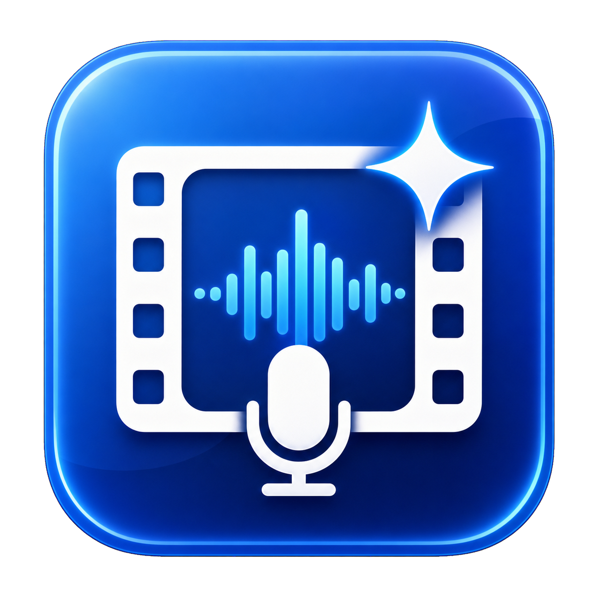

# 视频分析 Agent 工作流



这是一个本地优先的视频感知层，供 CLI、Codex、Claude Code、Cursor 或其他支持 MCP 的 Agent 使用。

## macOS 桌面端

原生 SwiftUI 桌面应用位于 [`desktop/`](desktop/)，支持选择视频、播放预览、查看关键帧、配置视觉模型和阅读分析报告。构建后可直接双击 `desktop/dist/视频分析台.app`。

桌面端也可粘贴抖音等视频链接。链接由 `yt-dlp` 下载到本地，保留作者和原始链接，再进入同一套抽帧、听觉转写和视觉分析流程。已完成的摘要、关键词和声音转写可以从左侧知识库搜索。

对于教程、知识分享和电影解说，桌面端提供“讲解优先”模式：先生成带时间戳的完整声音转写，让 AI 只根据讲解内容规划需要视觉确认的时间范围，再在这些位置定向抽帧，同时保留少量全片覆盖画面。报告、关键词、画面文字和完整转写中的时间码可以点击并跳到原视频对应位置。

```bash
cd desktop
./script/build_and_run.sh
```

它不会把每一帧都发送给模型。工作流先使用 FFmpeg 检测镜头变化，在每个镜头内部选择稳定代表画面，再与固定间隔覆盖帧合并。这样会避开黑场、转场和不完整切换帧。Agent 发现关键动作或不确定位置后，可以围绕指定时间点进行第二轮密集抽帧。

## 工作流程

```text
视频
 ├─ ffprobe：时长、分辨率、帧率、音轨
 ├─ FFmpeg：固定间隔覆盖帧
 ├─ FFmpeg scene score：镜头边界
 ├─ 每个镜头内部代表帧 + 全片覆盖帧
 ├─ 可选语音转写：先生成带时间戳字幕
 ├─ 视觉模型：结合同期台词分批理解画面
 └─ 二次模型调用：合并为摘要、回答、时间线和不确定性
```

讲解优先模式使用另一条顺序：

```text
视频声音 → 带时间戳转写 → AI 规划视觉取证时间 → 定向抽帧 + 稀疏保底帧
         → 视觉核对 → 声音和画面合并报告 → 点击时间码返回原视频
```

所有结果保存在 `output/视频名-日期-编号/`：

```text
manifest.json       抽帧清单和视频元信息
frames/             带时间戳的代表帧
audio.wav/mp3       启用转写时生成
transcript.txt      带时间戳的转写
analysis.json       完整结构化结果
report.md           便于阅读的报告
```

## 安装

本机需要 Python 3.10+、FFmpeg 和 `uv`。macOS 可通过 Homebrew 安装：

```bash
brew install ffmpeg uv
```

```bash
cd "/absolute/path/to/video-agent"
uv sync
uv run video-agent doctor
```

## 不配置 Key 也能使用

读取视频信息：

```bash
uv run video-agent probe "/绝对路径/video.mp4"
```

检测镜头并抽帧：

```bash
uv run video-agent prepare "/绝对路径/video.mp4"
```

导入视频链接（部分抖音内容需要浏览器已登录）：

```bash
uv run video-agent import-url "https://v.douyin.com/..." --browser-cookies safari
```

在 `01:25` 前后两秒内每秒抽两帧：

```bash
uv run video-agent detail "/绝对路径/video.mp4" --at 01:25 --radius 2 --fps 2
```

调整粗分析帧数：

```bash
uv run video-agent prepare "/绝对路径/video.mp4" \
  --interval 8 \
  --max-frames 50 \
  --scene-threshold 0.30
```

## 配置视觉 API

复制配置模板：

```bash
cp .env.example .env
```

Key 只填写在 `.env`；该文件已加入 `.gitignore`。

### OpenAI 兼容接口

适合 OpenAI、OpenRouter、SiliconFlow、DashScope 兼容模式等：

```dotenv
VIDEO_AGENT_PROVIDER=openai_compatible
VIDEO_AGENT_API_KEY=你的Key
VIDEO_AGENT_BASE_URL=https://dashscope.aliyuncs.com/compatible-mode/v1
VIDEO_AGENT_VISION_MODEL=qwen3-vl-flash
```

供应商必须支持 OpenAI `chat/completions` 风格的多图片输入。

### Gemini

```dotenv
VIDEO_AGENT_PROVIDER=gemini
VIDEO_AGENT_API_KEY=你的Key
VIDEO_AGENT_BASE_URL=https://generativelanguage.googleapis.com/v1beta
VIDEO_AGENT_VISION_MODEL=gemini-2.5-flash
```

模型名称只是模板默认值。实际使用前应根据账户中可用的当前模型填写。

### 免费本地听觉（推荐）

使用开源 `whisper.cpp` 在本机听取对白，不需要 API Key，音频也不会上传。双击 `安装免费听觉模型.command`，或运行：

```bash
./script/setup_local_whisper.sh
```

然后配置：

```dotenv
VIDEO_AGENT_TRANSCRIPTION_PROVIDER=local_whisper
VIDEO_AGENT_LOCAL_WHISPER_MODEL=models/ggml-large-v3-turbo.bin
VIDEO_AGENT_TRANSCRIPTION_PROMPT=教程、收藏夹、抖音、私信、下载视频、爬取视频、飞书表格、Codex。
VIDEO_AGENT_TRANSCRIPTION_LANGUAGE=zh
```

默认使用 `large-v3-turbo` 多语言模型；本地中文结果会统一转换为简体。可在“术语提示”中加入视频常见的人名、产品名或行业词，减少同音词误识别。

只听声音、不调用视觉模型：

```bash
uv run video-agent transcribe "/绝对路径/video.mp4"
```

### 可选云端音频转写

只配置视觉模型时，工作流可以分析画面，但听不到对白。若服务提供 OpenAI 兼容的 `/audio/transcriptions` 接口，可增加：

```dotenv
VIDEO_AGENT_TRANSCRIPTION_PROVIDER=openai_compatible
VIDEO_AGENT_TRANSCRIPTION_MODEL=whisper-1
VIDEO_AGENT_TRANSCRIPTION_BASE_URL=https://api.openai.com/v1
VIDEO_AGENT_TRANSCRIPTION_API_KEY=你的转写Key
```

选择 `none` 就不会提取或上传音频。

## 调用模型分析

```bash
uv run video-agent analyze "/绝对路径/video.mp4" \
  --question "分析视频中人物的操作步骤，并给出每一步的时间点"
```

声音优先分析讲解视频：

```bash
uv run video-agent analyze "/绝对路径/video.mp4" \
  --mode narration \
  --question "整理讲解中的工具、关键词和操作步骤，并用画面核对"
```

长视频默认每 6 秒提供一个覆盖候选，同时加入镜头内部代表帧，最终最多发送 60 帧。启用听觉时，会先转写声音，再把每一批画面对应时间段的台词一并交给视觉模型，最后汇总时间线和关键词。都可以在 `.env` 中调整。

## 连接 Agent（MCP）

项目提供四个 MCP 工具：

- `probe_video`：查看视频元信息。
- `prepare_video`：镜头检测和粗抽帧，不使用 API。
- `analyze_video`：抽帧、视觉分析和最终汇总。
- `extract_frames_at`：在指定时间附近密集抽帧。

MCP 配置示例见 `mcp-config.example.json`。启动命令是：

```bash
uv run video-agent-mcp
```

推荐 Agent 执行策略：

1. 调用 `probe_video` 判断长度。
2. 调用 `prepare_video` 获取代表帧和时间线覆盖。
3. 需要完整理解时调用 `analyze_video`。
4. 第一轮模型可以通过 `detail_requests` 要求在最多三个关键时间点自动密集抽帧；Agent 也可以继续调用 `extract_frames_at` 手动复查。

## 测试

测试会现场生成一个两秒的红蓝场景视频，不需要 API Key：

```bash
uv run --with pytest pytest -q
```

## 隐私与成本

- `probe`、`prepare` 和 `detail` 完全在本地运行。
- 只有 `analyze` 会把抽出的 JPEG 帧发送到配置的视觉服务商。
- 本地 Whisper 不上传音频；只有显式选择云端转写时，音频才会发送给转写服务商。
- 视频原文件不会由本工具直接上传；Gemini 适配器同样采用抽帧模式。
- 帧数、分辨率和批次大小会直接影响视觉 Token 成本。

## 使用边界与免责声明

- 本项目是**本地优先的个人视频理解工具**，不是任何视频平台的官方产品。
- 仅用于分析**你有权处理的内容**；不提供绕过付费、版权保护或访问控制的能力。
- 请遵守素材来源平台的用户协议与当地法律；使用后果由使用者自行承担。

## License

GPL-3.0 —— 详见 [LICENSE](LICENSE)。衍生作品需以相同协议开源。
